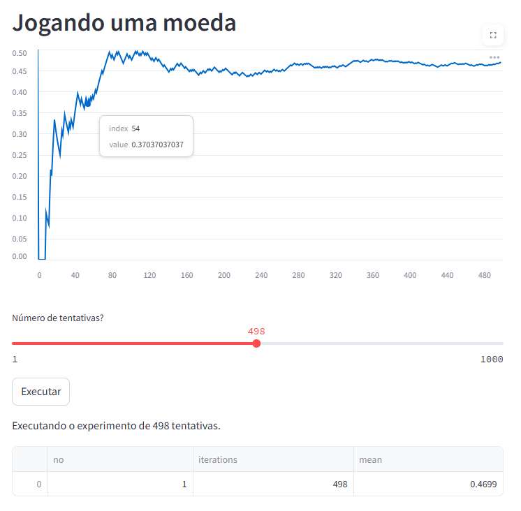

# 🪙 Coin Flip Simulation with Streamlit

## 📚 Description

This is an interactive web application built using **Streamlit** and **SciPy** to simulate coin tosses and visualize the behavior of probabilities under the Bernoulli distribution. It helps demonstrate how the empirical mean converges to the expected value (0.5) as the number of trials increases — a practical visualization of the Law of Large Numbers.

---

## 🛠️ Technologies Used

- Python
- Streamlit
- Pandas
- SciPy

---

## 🚀 How to Run

```bash
# Clone the repository
git clone https://github.com/andre-maccarini/coin-flip-simulation-streamlit.git

# Navigate to the project folder
cd coin-flip-simulation-streamlit

# Install dependencies
pip install -r requirements.txt

# Run the app
streamlit run app.py

```

## 🎮 Preview



## 📊 Features

✅ Interactive slider to select the number of coin tosses (1 to 1000)

✅ Real-time chart of empirical probability as simulation progresses

✅ Session-based tracking of multiple experiment results

✅ Data table with number of trials and corresponding means

## 🧠 What I Learned

How to simulate Bernoulli distributions using scipy.stats

How to update charts in real time with Streamlit

How to manage application state with st.session_state

## 📈 Possible Improvements

 Add option to simulate biased coins

 Add mathematical explanations alongside visualizations

 Add export of experiment results to CSV

## ✍️ Author

André Maccarini